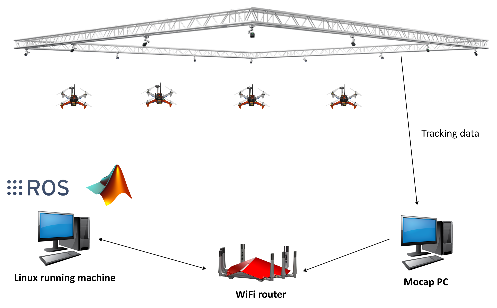
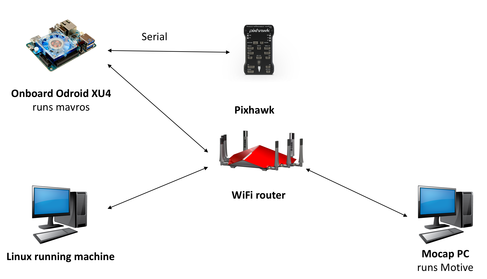

## vrpn_client_node
`vrpn_client_node` is a ros node, used to obtain `optitrack` pose data `/vrpn_client_node/RigidBody/pose`. If `Up Axis` is set to `Z Up` in `motive`, the pose data is in the `ENU`(X East, Y North, Z Up) or `FLU`(X Forward, Y Left, Z Up) coordinate system. This conforms to ROS conventions.

Usually the computer running `vrpn_client_node` and the computer running `Motive` software are under the same local area network (LAN). This `vrpn_client_node` has two potential uses:
- Use mavros to send to pixhawk by remapping topic `/vrpn_client_node/RigidBody/pose` to `/mavros/vision_pose/pose`. mavros is responsible for converting `ENU` to the `NED`(X North, Y East, Z Down) coordinate system used by `PX4`.

- Send directly to the USB device, and use the serial port to transmit the data to the microcontroller. The coordinate system needs to be transformed manually.

System Architecture:





- QGC or offboard control node running on the linux running machine.
- Companion computer is XU4. we can use raspberry pi instead of XU4.
The `mavros` and `vrpn_client_node` running on Companion computer, so as the master node of ros.


## run vrpn_client_node
connect to the same wifi with motive computer(IP: 192.168.3.252), and then run

>192.168.3.252 is the computer ip which running motive 
```bash
mkdir -p ~/catkin_ws/src
cd ~/catkin_ws/src
git clone https://github.com/SCUT-DuctedFan/vrpn_client_ros.git
cd ..
catkin_make
roslaunch vrpn_client_ros sample.launch server:=192.168.3.252 
```

## result
we can see rviz, and the frame is ENU.

print the topic of ros:

```bash
rostopic echo /mavros/vision_pose/pose
```
the terminal output isL

```Console
---
header: 
  seq: 9390
  stamp: 
    secs: 1682315199
    nsecs: 620635421
  frame_id: "world"
pose: 
  position: 
    x: 1.7827200889587402
    y: -1.8732807636260986
    z: 0.8786203861236572
  orientation: 
    x: -0.0005116735119372606
    y: -0.0013188595185056329
    z: -0.05677390471100807
    w: 0.998386025428772
---

```

## run mavros
finally, install [mavros](https://docs.px4.io/main/en/ros/mavros_installation.html) and run it by follow command, then the data transfer to pixhawk. the mavros can 

ROS uses ENU frames by convention. Assume the Optitrack system have set `Up Axis` to `Z Up`, and the data obtained by using the vrpn_client_node node is ENU frame. Through topic remapping, mavros/vision_pose/pose is obtained. MAVROS is responsible for converting the ENU frame of mavros/vision_pose/pose into the NED frame used by px4.

>fcu_url is the usb dev, gcs_url is the QGC(ground control station, gcs) computer IP.

```bash
roslaunch mavros px4.launch fcu_url:=/dev/ttyUSB0:921600 gcs_url:=udp://@192.168.3.190
```


