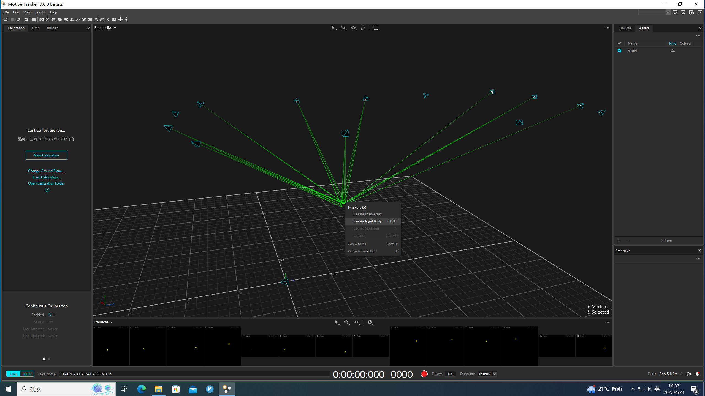
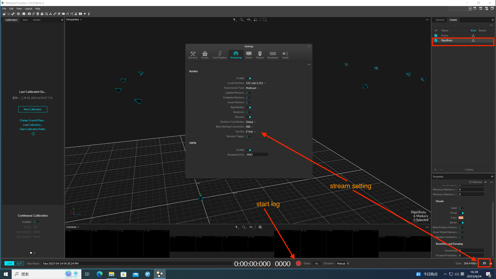
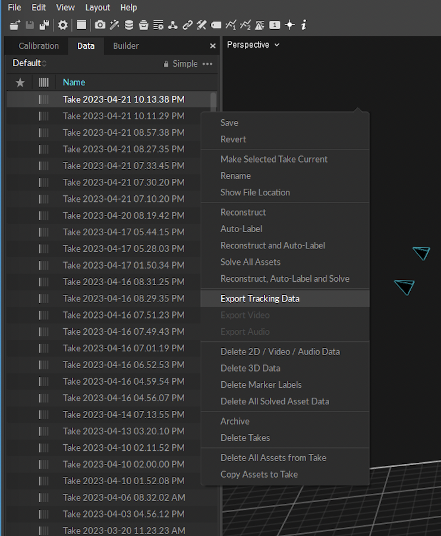
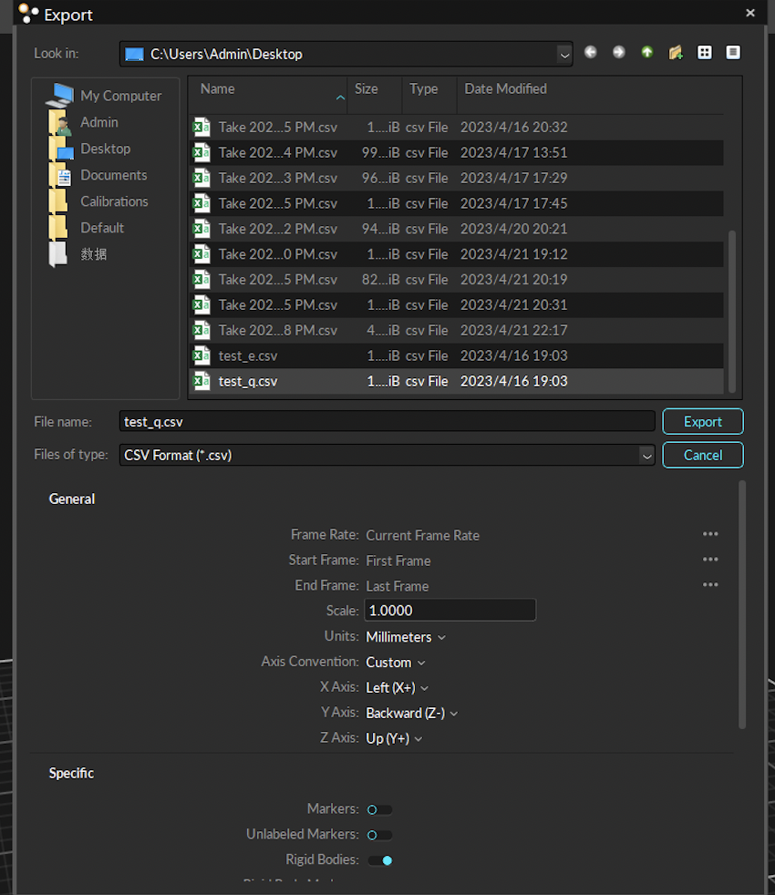
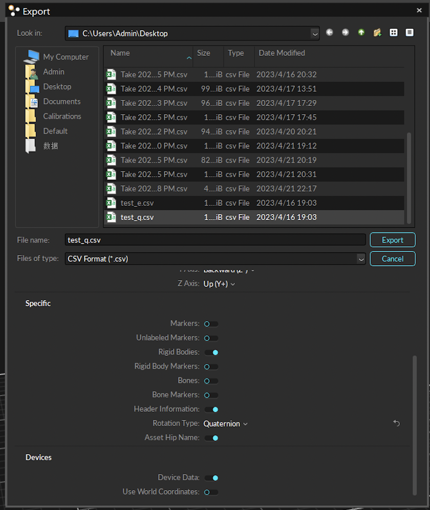
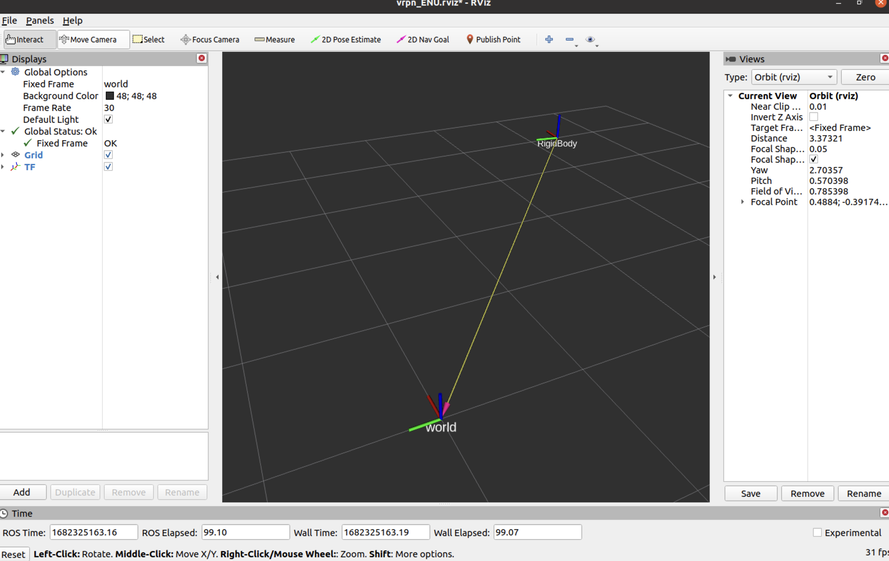

## vrpn_client_node
`vrpn_client_node` is a ros node, used to obtain `optitrack` pose data `/vrpn_client_node/RigidBody/pose`. If `Up Axis` is set to `Z Axis` in `motive`, the pose data is in the `ENU`(X East, Y North, Z Up) or `FLU`(X Forward, Y Left, Z Up) coordinate system. This conforms to ROS conventions.

Usually the computer running `vrpn_client_node` and the computer running `Motive` software are under the same local area network (LAN). This `vrpn_client_node` has two potential uses:
- Use mavros to send to pixhawk by remapping topic `/vrpn_client_node/RigidBody/pose` to `/mavros/vision_pose/pose`. mavros is responsible for converting `ENU` to the `NED`(X North, Y East, Z Down) coordinate system used by `PX4`.

- Send directly to the USB device, and use the serial port to transmit the data to the microcontroller. The coordinate system needs to be transformed manually.

System Architecture:


- QGC or offboard control node running on the linux running machine.
- Companion computer is XU4. we can use raspberry pi instead of XU4.
The `mavros` and `vrpn_client_node` running on Companion computer, so as the master node of ros.

## Mocap computer settings

1. Align the UAV x-axis (forward direction) roughly with the x-axis of the optitrack system, select all marked points, and right-click to create a rigid body.



2. Set `Up Axis` to `Z Axis`, and enable the stream.



3. (optional) click the red point to start log. Click it again to stop. Then you can save the log file. We use ENU frame of data in log config:





After `motive` sends the data to the LAN, download this code on the computer that needs to get the data and compile and run vrpn_client_node.
## Build 


Build the code:
```bash
mkdir -p ~/catkin_ws/src
cd ~/catkin_ws/src
git clone https://github.com/SCUT-DuctedFan/vrpn_client_ros.git
cd ..
catkin_make
```
### another way for use vrpn-client-ros
1. sudo apt-get install ros-noetic-vrpn-client-ros
2. ping server ip 
3. roslaunch vrpn_client_ros sample.launch server:=192.168.3.252 


For visual directly

1. cd ~/catkin_ws/src
catkin_create_pkg optitrack

2. cd ~/catkin_ws/src/optitrack
mkdir launch

Add lunch like this repos.

3. cd ~/catkin_ws/src/optitrack
mkdir config

Add config like this repos.

4. cd ~/catkin_ws
catkin_make

5. Source devel/setup.bash

6. roslaunch optitrack sample.launch server:=192.168.3.252  

for raspberry pi, don't run rviz.
## Run vrpn_client_node
connect to the same wifi with motive computer(IP: 192.168.3.252), and then run

>192.168.3.252 is the computer ip which running motive 
```bash
roslaunch vrpn_client_ros sample.launch server:=192.168.3.252 
```

## Result
we can see rviz, and the frame is ENU.


Run the follow command to print the topic of ros:

```bash
rostopic echo /mavros/vision_pose/pose
```
the terminal output is

```Console
---
header: 
  seq: 9390
  stamp: 
    secs: 1682315199
    nsecs: 620635421
  frame_id: "world"
pose: 
  position: 
    x: 1.7827200889587402
    y: -1.8732807636260986
    z: 0.8786203861236572
  orientation: 
    x: -0.0005116735119372606
    y: -0.0013188595185056329
    z: -0.05677390471100807
    w: 0.998386025428772
---

```

## Run mavros
finally, install [mavros](https://docs.px4.io/main/en/ros/mavros_installation.html) and run it by follow command, then the data transfer to pixhawk. install mavros from Binary is simple:
 ```bash
 sudo apt-get install ros-${ROS_DISTRO}-mavros ros-${ROS_DISTRO}-mavros-extras ros-${ROS_DISTRO}-mavros-msgs
 ```
Then install GeographicLib datasets by running the install_geographiclib_datasets.sh script:
```bash
wget https://raw.githubusercontent.com/mavlink/mavros/master/mavros/scripts/install_geographiclib_datasets.sh
sudo bash ./install_geographiclib_datasets.sh
```
Or you can [build it from source](https://docs.px4.io/main/en/ros/mavros_installation.html#source-installation).

ROS uses ENU frames by convention. Assume the Optitrack system have set `Up Axis` to `Z Up`, and the data obtained by using the vrpn_client_node node is ENU frame. Through topic remapping, mavros/vision_pose/pose is obtained. MAVROS is responsible for converting the ENU frame of mavros/vision_pose/pose into the NED frame used by px4.

>fcu_url is the usb dev, gcs_url is the QGC(ground control station, gcs) computer IP.

```bash
roslaunch mavros px4.launch fcu_url:=/dev/ttyUSB0:921600 gcs_url:=udp://@192.168.3.190
```
or after setup by [USB Serial Port Software setup on Linux](https://docs.px4.io/main/en/companion_computer/pixhawk_companion.html), run

```bash
roslaunch mavros px4.launch fcu_url:=/dev/ttyPixhawk:921600 gcs_url:=udp://@192.168.3.190
```

